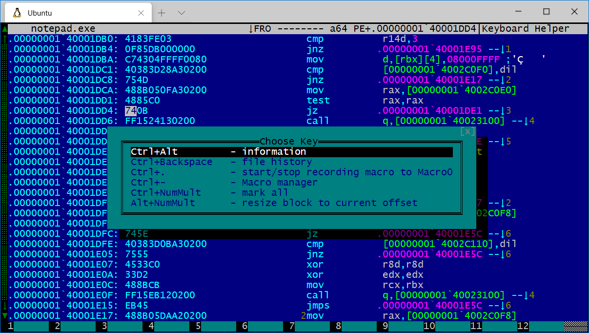

# Hiewkey

This is a simple HEM (aka plugin) for the Hiew hex editor that simulates key
presses that are not possible when using a virtual terminal.

If you use Hiew over ssh, or under wsl, then this will help you use features
that normally require a Windows console.

# Installation

Copy `hiewkey.hem` to your `hem` folder, which is usually where you installed
hiew.

# Notes

Please file an issue if there are keystrokes I need to add.

# Author

Tavis Ormandy <taviso@gmail.com>
